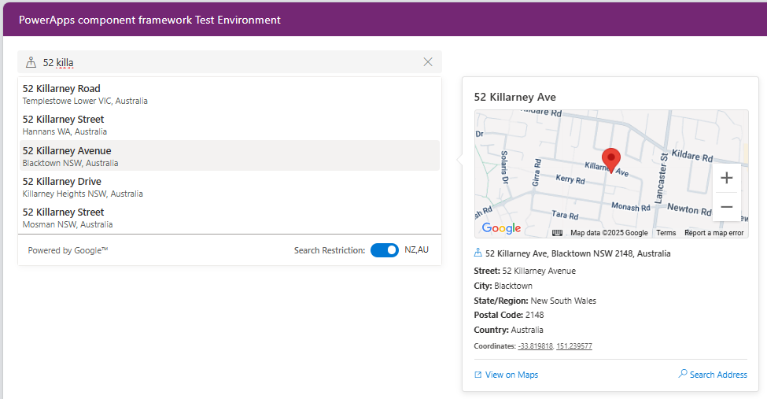

# PCF FluentUI AutoComplete - Google Places

A powerful PowerApps Component Framework (PCF) control that provides Google Places autocomplete functionality with React and FluentUI. This control integrates seamlessly with Dataverse and offers advanced features like interactive hover cards with Google Maps integration, detailed place information dialogs, country restrictions, and comprehensive address parsing.



## ✨ Features

### 🌍 Google Places Integration

- **Modern API Support**: Uses the latest Google Places JavaScript API with fallback to legacy API
- **Real-time Search**: Debounced search with configurable minimum character length
- **Country Restrictions**: Optional filtering by country codes (e.g., 'NZ,AU')
- **Toggle Control**: Users can enable/disable country restrictions on-the-fly

### 🗺️ Interactive Experience

- **Smart Hover Cards**: Rich place information displayed on hover with Google Maps integration
- **Detailed Dialog Views**: Full-screen place details with tabbed interface (Map, Street View, Details)
- **Smooth Mouse Interactions**: Invisible bridge areas allow seamless movement between components
- **Smart Positioning**: Coordinate-based arrow positioning that points accurately to hovered items
- **Maps Integration**: Interactive Google Maps with markers, Street View panoramas

### 🎨 Modern UI/UX

- **FluentUI Components**: Consistent with Microsoft's design system and theming
- **Responsive Design**: Adapts to different screen sizes and containers
- **Consistent Headers**: Unified header design across all modal components
- **Loading States**: Smooth loading indicators and error handling
- **Accessibility**: Keyboard navigation and screen reader support

### 📍 Comprehensive Address Parsing

- **Complete Address Components**: Street, suburb, city, state, country, postal code
- **Geographic Coordinates**: Latitude and longitude for mapping
- **Building Information**: Premise/building details when available
- **Flexible Formats**: Choose between full names or abbreviations for states/countries
- **Rich Place Data**: Ratings, business hours, place types, and external links

## 🚀 Quick Start

### Prerequisites

- Power Platform CLI installed
- Node.js (version 18 or higher)
- Google Places API key with Places API enabled
- Power Platform environment with PCF controls enabled

### Installation

1. **Clone the repository**
   ```bash
   git clone https://github.com/garethcheyne/PCF-FluentUi-AutoComplete-GooglePlaces.git
   cd PCF-FluentUi-AutoComplete-GooglePlaces
   ```

2. **Install dependencies**
   ```bash
   npm install
   ```

3. **Build and package for Power Platform**
   ```bash
   # Quick release build (most common)
   npm run boom
   
   # Debug build for development
   npm run boom-debug
   ```

4. **Test locally (optional)**
   ```bash
   npm start watch
   ```

### 🎯 Usage Examples

#### Basic Setup
1. Add the control to a form or canvas app
2. Set the **Google API Key** property
3. Bind output fields to your data source
4. Users can search and select addresses

#### With Country Restrictions
1. Set **countryRestriction** to "US,CA" (for US and Canada only)
2. Users can toggle between restricted and worldwide search
3. The footer shows current restriction status

#### Advanced Configuration
```javascript
// Example configuration for a US-focused application
{
  "apiToken": "your-google-api-key",
  "countryRestriction": "US",
  "stateReturnShortName": true,
  "countryReturnShortName": false
}
```

---

## �️ Build System (BuildDataversePCFSolution)

This project includes an advanced CI/CD system for automated PCF building and packaging.

### Available Build Commands

| Command | Purpose | Output |
|---------|---------|---------|
| `npm run boom` | Production build (both managed & unmanaged) | `releases/` directory |
| `npm run boom-debug` | Debug build for development | `releases/` directory |
| `npm run boom-managed` | Managed solution only | `releases/` directory |
| `npm run boom-unmanaged` | Unmanaged solution only | `releases/` directory |
| `npm run boom-check` | Validate development environment | Console output |

### Auto-Incrementing Versions

The build system automatically increments patch versions on each build with intelligent rollover:
- `1.0.2` → `1.0.3` (normal increment)
- `0.0.99` → `0.1.0` (minor rollover)
- `0.99.99` → `1.0.0` (major rollover)

---

## ⚙️ Configuration

### Required Properties

| Property | Type | Description |
|----------|------|-------------|
| **apiToken** | String | Google Places API key (required) |

### Optional Properties

| Property | Type | Default | Description |
|----------|------|---------|-------------|
| **countryRestriction** | String | - | ISO 3166-1 alpha-2 country codes (e.g., 'NZ,AU') |
| **stateReturnShortName** | Boolean | false | Return state as abbreviation (e.g., 'CA' vs 'California') |
| **countryReturnShortName** | Boolean | false | Return country as code (e.g., 'US' vs 'United States') |

### Output Properties

The control populates the following fields automatically:

| Field | Description | Example |
|-------|-------------|---------|
| **street** | Street number and name | "123 Main Street" |
| **suburb** | Suburb/locality | "Downtown" |
| **city** | City name | "San Francisco" |
| **state** | State/region | "California" or "CA" |
| **country** | Country name | "United States" or "US" |
| **latitude** | Geographic latitude | "37.7749" |
| **longitude** | Geographic longitude | "-122.4194" |
| **building** | Building/premise | "Suite 100" |
| **postcode** | Postal/ZIP code | "94102" |

## 🎯 Usage Examples

### Basic Setup
1. Add the control to a form or canvas app
2. Set the **Google API Key** property
3. Bind output fields to your data source
4. Users can search and select addresses

### With Country Restrictions
1. Set **countryRestriction** to "US,CA" (for US and Canada only)
2. Users can toggle between restricted and worldwide search
3. The footer shows current restriction status

### Advanced Configuration
```javascript
// Example configuration for a US-focused application
{
  "apiToken": "your-google-api-key",
  "countryRestriction": "US",
  "stateReturnShortName": true,
  "countryReturnShortName": false
}
```

## 🔧 Development

### Project Structure

```
PCF-FluentUi-AutoComplete-GooglePlaces/
├── PCFFluentUiAutoComplete/
│   ├── tsx/
│   │   ├── AutoComplete.tsx          # Main search component
│   │   ├── EntityHoverCard.tsx       # Interactive hover cards
│   │   ├── PlaceDetailsCallout.tsx   # Callout wrapper component
│   │   ├── PlaceDetailsDialog.tsx    # Full-screen place details dialog
│   │   └── Queries.tsx              # Google Places API utilities
│   ├── types/
│   │   └── EntityDetailTypes.ts     # TypeScript definitions
│   ├── css/
│   │   └── PCFFluentUiAutoComplete.css # Component styling
│   ├── ControlManifest.Input.xml    # PCF manifest
│   └── index.ts                     # Entry point
├── screenshots/
│   └── screenshot01.png             # Demo screenshots
├── solution.yaml                    # Build configuration
├── package.json                     # Dependencies and scripts
└── tsconfig.json                    # TypeScript configuration
```

### Key Components

#### AutoComplete.tsx
- Main search component with FluentUI SearchBox
- Handles user input, debouncing, and suggestion display
- Manages hover states and coordinate-based positioning
- Implements invisible bridge for smooth UX

#### EntityHoverCard.tsx & PlaceDetailsCallout.tsx
- Interactive hover card system with Google Maps integration
- Shows place details, address components, and ratings
- Smart arrow positioning using DOM coordinates
- Handles loading states and error conditions

#### PlaceDetailsDialog.tsx
- Full-screen modal dialog with comprehensive place information
- Tabbed interface: Map View, Street View, and Details
- Interactive Google Maps and Street View integration
- Consistent header design with other components

#### Queries.tsx & EntityDetailTypes.ts
- Google Places API integration layer
- Comprehensive TypeScript definitions for Google Places API
- Handles API key validation and error handling
- Implements country restriction filtering

### Building and Testing

```bash
# Install dependencies
npm install

# Start development server
npm start

# Build for production
npm run build

# Run tests (if available)
npm test

# Clean build artifacts
npm run clean
```

## 🌐 Google Places API Setup

1. **Enable APIs** in Google Cloud Console:
   - Places API (New)
   - Places API  
   - Maps JavaScript API

2. **Create API Key**:
   - Go to Google Cloud Console → APIs & Services → Credentials
   - Create a new API key
   - Restrict the key to your domains for security

3. **API Key Restrictions** (Recommended):
   ```
   Application restrictions:
   - HTTP referrers
   - Add your Power Platform domains

   API restrictions:
   - Places API (New)
   - Places API
   - Maps JavaScript API
   ```

## � Performance & Features

- **Debounced Search**: 500ms delay reduces API calls
- **Minimum Query Length**: 3 characters prevents excessive requests
- **Smart Caching**: Browser caches API responses
- **Lazy Loading**: Maps load only when needed
- **Efficient Rendering**: React optimizations for smooth UX
- **Interactive Hover Cards**: Rich place information with maps
- **Full-Screen Dialogs**: Comprehensive place details with Street View

## 🐛 Troubleshooting

### Common Issues

- **"API Key not provided" Error**: Ensure the `apiToken` property is set with a valid Google Places API key
- **"No results found"**: Verify the search query is at least 3 characters long
- **Hover cards not showing**: Verify Google Maps JavaScript API is enabled
- **Build Failures**: Clear node modules and reinstall: `rm -rf node_modules package-lock.json && npm install`

## 🤝 Contributing

1. Fork the repository
2. Create a feature branch (`git checkout -b feature/amazing-feature`)
3. Commit your changes (`git commit -m 'Add amazing feature'`)
4. Push to the branch (`git push origin feature/amazing-feature`)
5. Open a Pull Request

### Development Guidelines

- Follow TypeScript best practices
- Use FluentUI components when possible
- Add comprehensive error handling
- Include JSDoc comments for public methods
- Test across different screen sizes

## 📄 License

This project is licensed under the MIT License - see the [LICENSE](LICENSE) file for details.

## 🙏 Acknowledgments

- **Microsoft FluentUI**: UI component library
- **Google Places API**: Location search and details
- **React**: Component framework
- **Power Platform**: PCF framework
- **Community**: Contributors and feedback

## 📞 Support

- **Issues**: [GitHub Issues](https://github.com/garethcheyne/PCF-FluentUi-AutoComplete-GooglePlaces/issues)
- **Discussions**: [GitHub Discussions](https://github.com/garethcheyne/PCF-FluentUi-AutoComplete-GooglePlaces/discussions)
- **Documentation**: This README and inline code comments

## 🗺️ Roadmap

- [ ] Multi-language support
- [ ] Custom styling options
- [ ] Offline mode support
- [ ] Additional map providers
- [ ] Enhanced accessibility features
- [ ] Performance analytics dashboard

---

**Made with ❤️ for the Power Platform community**

*If this control helps your project, please consider giving it a ⭐ on GitHub!*